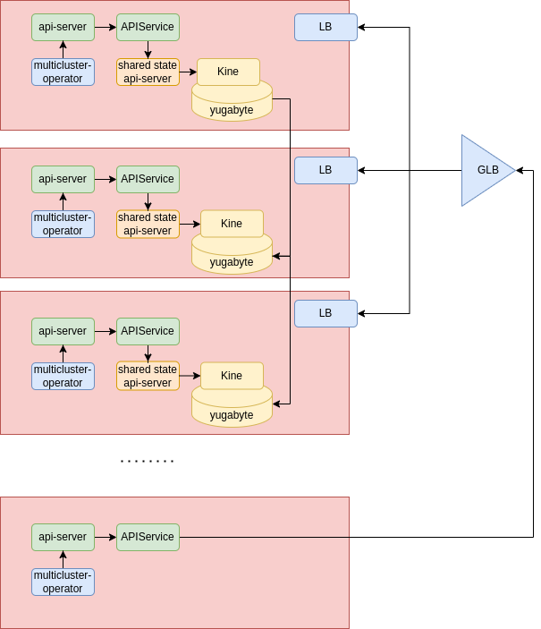
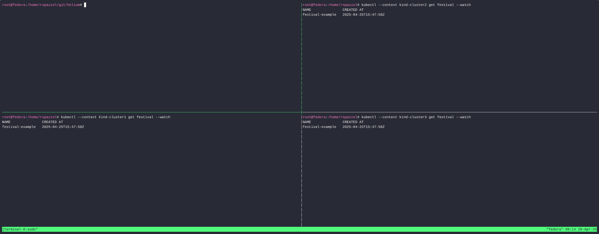

# Helium 

This is a different approach to multi-cluster that has the objective of solving the following issue:

1. hub and spoke topologies have an inherent point of failure
2. using etcd to share state between cluster is inherently not scalable (you can get maybe to 100 clusters).
3. writing multi-cluster operators is hard because current frameworks and libraries to write operator are not designed to let controller observe multiple control planes 

For a more in detail explanation see [why](./why.md)

## Architecture



In this architecture we can see a shared control plane stretched between three clusters. These clysters are in different failure domains making the shared control plane resilient to disasters. The storage of the shared control plane is implement with Yugabyte abd kine. Yugabyte providers and indefinitely scalable fully consistent distributed SQL storage. Kine is a simple shim that exposes SQL storage with an etcd interface.
The shared control plane is accessible by the operators and controller via one or more APIServices. APIServices instruct an api-server to forward a request for certain api/groups. This allows to write controller with the common library knowing that for some api/groups, the storage is actually shared between clusters.

## Demo



## getting started quickly

To quickly start, run

```sh
sudo su
./setup.sh
```

If you need to setup step by step, follow the steps below.
You need to be root to run this setup because cilium on kind does not work with rootless containers.

## setup helm

```sh
sudo su
```

```sh
helm repo add cilium https://helm.cilium.io/
helm repo add yugabytedb https://charts.yugabyte.com
```

## deploy kind clusters

```sh
go install sigs.k8s.io/kind@v0.27.0
sudo su #cilium does not work with rootless containers
setenforce 0
kind create cluster -n cluster1 --config ./kind-config/config-cluster1.yaml & 
kind create cluster -n cluster2 --config ./kind-config/config-cluster2.yaml &
kind create cluster -n cluster3 --config ./kind-config/config-cluster3.yaml &
wait
```

## deloy cert-manager crds

```sh
for cluster in cluster1 cluster2 cluster3; do
  kubectl --context kind-${cluster} apply -f https://github.com/cert-manager/cert-manager/releases/download/v1.17.1/cert-manager.crds.yaml
done
```

## deploy ingress API CRDs

```sh
for cluster in cluster1 cluster2 cluster3; do
  kubectl --context kind-${cluster} apply -f https://github.com/kubernetes-sigs/gateway-api/releases/download/v1.2.0/standard-install.yaml
  kubectl --context kind-${cluster} apply -f https://raw.githubusercontent.com/kubernetes-sigs/gateway-api/v1.2.0/config/crd/experimental/gateway.networking.k8s.io_tlsroutes.yaml
done
```

## deploy mcp apis

```sh
for cluster in cluster1 cluster2 cluster3; do
kubectl --context kind-${cluster} apply -f https://raw.githubusercontent.com/kubernetes-sigs/mcs-api/62ede9a032dcfbc41b3418d7360678cb83092498/config/crd/multicluster.x-k8s.io_serviceexports.yaml
kubectl --context kind-${cluster} apply -f https://raw.githubusercontent.com/kubernetes-sigs/mcs-api/62ede9a032dcfbc41b3418d7360678cb83092498/config/crd/multicluster.x-k8s.io_serviceimports.yaml
done
```

## patch core-dns

inspect kind network
```sh
podman network inspect -f '{{range .Subnets}}{{if eq (len .Subnet.IP) 4}}{{.Subnet}}{{end}}{{end}}' kind
10.89.0.0/24
```


patch core-dns to have headless services resolve

```sh
export cluster1_coredns_ip="10.89.0.225"
export cluster2_coredns_ip="10.89.0.233"
export cluster3_coredns_ip="10.89.0.241"
declare -A coredns_ips
coredns_ips["cluster1"]="10.89.0.225"
coredns_ips["cluster2"]="10.89.0.233"
coredns_ips["cluster3"]="10.89.0.241"
for cluster in cluster1 cluster2 cluster3; do
  kubectl --context kind-${cluster} patch deployment coredns -n kube-system -p '{"spec":{"replicas": 1,"template":{"spec":{"containers": [{"name":"coredns","image":"quay.io/raffaelespazzoli/coredns:v1.12.0-master-multicluster-gathersrv", "imagePullPolicy": "Always", "resources": {"limits":{"memory":"512Mi"}}}]}}}}'
  envsubst < ./core-dns/corefile-configmap-${cluster}.yaml | kubectl --context kind-${cluster} apply -f -
  coredns_ip=${coredns_ips[${cluster}]} envsubst < ./core-dns/coredns-service.yaml | kubectl --context kind-${cluster} apply -f -
  kubectl --context kind-${cluster} patch clusterrole system:coredns --type=json \
   -p='[{"op":"add","path":"/rules/-","value":{"apiGroups":["multicluster.x-k8s.io"],"resources":["serviceimports"],"verbs":["list","watch"]}}]'
done
```

## install cilium

```sh
declare -A cluster_ips
export cluster1_ip="10.89.0.224"
export cluster2_ip="10.89.0.232"
export cluster3_ip="10.89.0.240"
cluster_ips["cluster1"]="10.89.0.224"
cluster_ips["cluster2"]="10.89.0.232"
cluster_ips["cluster3"]="10.89.0.240"
export cidr_cluster1="10.89.0.224/29"
export cidr_cluster2="10.89.0.232/29"
export cidr_cluster3="10.89.0.240/29"
declare -A ingress_ips
ingress_ips["cluster1"]="10.89.0.226"
ingress_ips["cluster2"]="10.89.0.234"
ingress_ips["cluster3"]="10.89.0.242"
for cluster in cluster1 cluster2 cluster3; do
  cluster=${cluster} ordinal=${cluster: -1} apiserver_ip=${cluster_ips[${cluster}]}  envsubst < ./cilium/values.yaml > /tmp/${cluster}-values.yaml
  helm --kube-context kind-${cluster} upgrade -i cilium cilium/cilium --version "1.17.2" --namespace kube-system -f /tmp/${cluster}-values.yaml
  ingress_ip=${ingress_ips[${cluster}]}  cluster=${cluster} envsubst < ./cilium/gateway.yaml | kubectl --context kind-${cluster} apply -f - -n kube-system
  cluster=${cluster} envsubst < ./cilium/httproute.yaml | kubectl --context kind-${cluster} apply -f - -n kube-system
done
```   

wait for cilium-operator to come up

```sh
kubectl --context kind-cluster1 wait pod -l app.kubernetes.io/name=cilium-operator -n kube-system --for=condition=Ready --timeout=600s & 
kubectl --context kind-cluster2 wait pod -l app.kubernetes.io/name=cilium-operator -n kube-system --for=condition=Ready --timeout=600s & 
kubectl --context kind-cluster3 wait pod -l app.kubernetes.io/name=cilium-operator -n kube-system --for=condition=Ready --timeout=600s &
wait
```

complete cilium configuration

```sh
export cidr_cluster1="10.89.0.224/29"
export cidr_cluster2="10.89.0.232/29"
export cidr_cluster3="10.89.0.240/29"
for cluster in cluster1 cluster2 cluster3; do
  vcidr=cidr_${cluster}
  cidr=${!vcidr} envsubst < ./cilium/ippool.yaml | kubectl --context kind-${cluster} apply -f -
done
```

## deploy cert-manager 

```sh
for cluster in cluster1 cluster2 cluster3; do
  kubectl --context kind-${cluster} apply -f https://github.com/cert-manager/cert-manager/releases/download/v1.17.1/cert-manager.yaml
done
```

wait for cert-manager pods to be up

```sh
kubectl --context kind-cluster1 wait pod --all -n cert-manager --for=condition=Ready --timeout=600s & 
kubectl --context kind-cluster2 wait pod --all -n cert-manager --for=condition=Ready --timeout=600s & 
kubectl --context kind-cluster3 wait pod --all -n cert-manager --for=condition=Ready --timeout=600s &
wait
```

this sort of hack is to share the CA across clusters

```sh
kubectl --context kind-cluster1 apply -f ./cert-manager/self-signed-issuer.yaml -n cert-manager
sleep 1
kubectl --context kind-cluster1 get secret root-secret -n cert-manager -o yaml > /tmp/root-secret.yaml
```

```sh
for cluster in cluster1 cluster2 cluster3; do
  kubectl --context kind-${cluster} apply -f /tmp/root-secret.yaml
  kubectl --context kind-${cluster} apply -f ./cert-manager/cluster-issuer.yaml -n cert-manager
done
```

wait for all the pods to be up

```sh
kubectl --context kind-cluster1 wait pod --all --for=condition=Ready -A --timeout=600s & 
kubectl --context kind-cluster2 wait pod --all --for=condition=Ready -A --timeout=600s & 
kubectl --context kind-cluster3 wait pod --all --for=condition=Ready -A --timeout=600s &
wait
```

verify that clusters are successfully connected:

```sh
cilium status --context kind-cluster1
cilium status --context kind-cluster2
cilium status --context kind-cluster3
cilium clustermesh status --context kind-cluster1
cilium clustermesh status --context kind-cluster2
cilium clustermesh status --context kind-cluster3
```

access hubble ui

```sh
cilium --context kind-${cluster} hubble ui
```

you can also access hubble via this address: `http://hubble.${cluster}.raffa`

make sure you have this in your hosts file

```txt
10.89.0.226 hubble.cluster1.raffa
10.89.0.234 hubble.cluster2.raffa
10.89.0.242 hubble.cluster3.raffa
```

## create h2 namespace

```sh
for cluster in cluster1 cluster2 cluster3; do
  kubectl --context kind-${cluster} create namespace h2
done
```

## deploy yugabyte

```sh
for cluster in cluster1 cluster2 cluster3; do
  cluster=${cluster} envsubst < ./yugabyte/manifests/yugabyte.yaml | kubectl --context kind-${cluster} apply -f - -n h2
done
```

connect to the yugabyte console by typing:

```
http://yugbyte.{cluster}.raffa
```

make sure you have this in your hosts file

```txt
10.89.0.226 yugabyte.cluster1.raffa
10.89.0.234 yugabyte.cluster2.raffa
10.89.0.242 yugabyte.cluster3.raffa
```

run this to troubleshoot / restart everything

```sh
for cluster in cluster1 cluster2 cluster3; do
  kubectl --context kind-${cluster} scale statefulsets yb-master -n h2 --replicas=0
  kubectl --context kind-${cluster} scale statefulsets yb-tserver -n h2 --replicas=0
  kubectl --context kind-${cluster} delete pvc datadir0-yb-master-0 datadir0-yb-tserver-0 datadir1-yb-master-0 datadir1-yb-tserver-0 -n h2 
done
for cluster in cluster1 cluster2 cluster3; do
  kubectl --context kind-${cluster} scale statefulsets yb-master -n h2 --replicas=1
  kubectl --context kind-${cluster} scale statefulsets yb-tserver -n h2 --replicas=1
done
```

## deploy kine

```sh
for cluster in cluster1 cluster2 cluster3; do
  kubectl --context kind-${cluster} apply -f ./kine/deployment.yaml -n h2
done
```

## deploy api-server

```sh
for cluster in cluster1 cluster2 cluster3; do
  kubectl --context kind-${cluster} apply -f ./api-server/aggregated-apiserver.yaml -n h2
  kubectl --context kind-${cluster} apply -f ./api-server/apiservice.yaml -n h2
  kubectl --context kind-${cluster} apply -f ./api-server/controller-manager.yaml -n h2
  kubectl --context kind-${cluster} apply -f ./api-server/rbac.yaml -n h2
  kubectl --context kind-${cluster} apply -f ./api-server/crd -n h2
done
```

<!-- ## deploy dashboard (optional)

```sh
for cluster in cluster1 cluster2 cluster3; do
  cluster=${cluster}  envsubst < ./dashboard/values.yaml > /tmp/values.yaml
  helm --kube-context kind-${cluster} upgrade --install kubernetes-dashboard kubernetes-dashboard/kubernetes-dashboard --create-namespace --namespace kubernetes-dashboard -f /tmp/values.yaml
  cluster=${cluster}  envsubst < ./dashboard/httproute.yaml | kubectl --context kind-${cluster} apply -f - -n kubernetes-dashboard
done
```

get bearer tokens:

```sh
for cluster in cluster1 cluster2 cluster3; do
  kubectl --context kind-${cluster} -n kubernetes-dashboard create token admin-user
done
```

Make sure you have this in your hosts file:

```txt
10.89.0.226 console.cluster1.raffa
10.89.0.234 console.cluster2.raffa
10.89.0.242 console.cluster3.raffa
```

## Install prometheus and grafana (optional)

```sh
for cluster in cluster1 cluster2 cluster3; do
  kubectl --context kind-${cluster} apply -f https://raw.githubusercontent.com/cilium/cilium/1.17.2/examples/kubernetes/addons/prometheus/monitoring-example.yaml
done
```

access grafana

```sh
kubectl --context kind-${cluster} -n cilium-monitoring port-forward service/grafana --address 0.0.0.0 --address :: 3000:3000
``` -->

### uninstall cilium 
```sh
for cluster in cluster1 cluster2 cluster3; do
helm --kube-context kind-${cluster} uninstall cilium --namespace kube-system
done
``` 

## restart kind clusters

```sh
podman restart -a
```

## remove everything

```sh
kind delete cluster -n cluster1 & 
kind delete cluster -n cluster2 & 
kind delete cluster -n cluster3 &
wait
```
