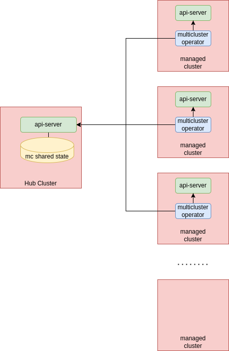
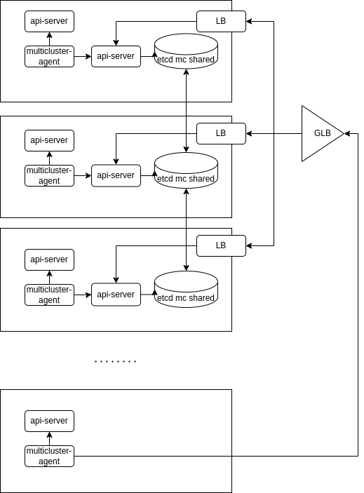
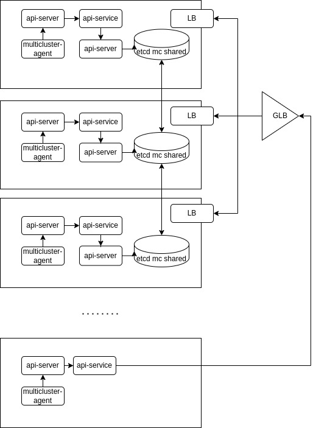
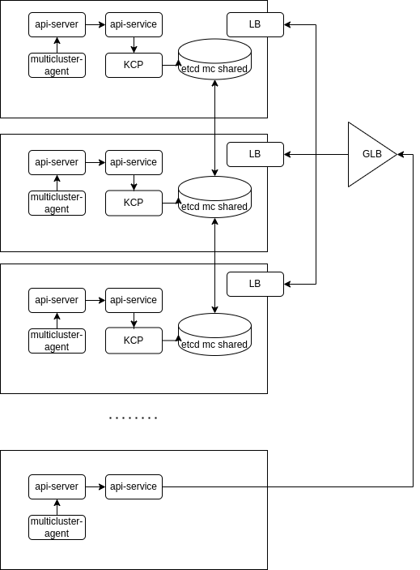
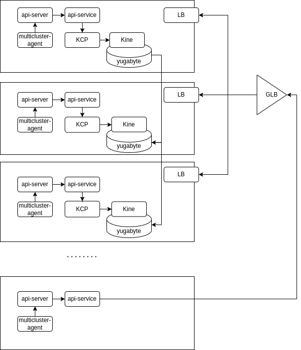

# Why Helium

Helium is an approach to creating a distributed control plane with the intent to make it easier to write multicluster operators.
What these operator will do is out of scope, so we think this solution is general enough to support any multicluster use case.

## traditional approach to multi-cluster

typically multicluster solutions look like this:

In this image we can see a hub cluster and several managed clusters.
The hub cluster control plane is used to drive the hub cluster, but also a storage for multicluster shared state.
The managed clusters have special operators (multicluster agents in the picture) that have to watch both the local control plane and the hub control plane for the shared state.

This architecture has the following issues:

1. the hub cluster is a single point of failure.
2. the multicluster agents are hard to write as kubebuilder and other framework wor developing operators are not design for watching multiple control planes
3. this architecture is not very scalable beyond a few hundred clusters.

## distributed control plane

To solve for the single point of failure issue, we can refactor he previous architecture to look like this:

In here we created a distributed control plane across three cluster, ideally in different failure domains.
The distributed control plane is also externally accessible from other cluster.
This control plane will store the shared state that every cluster needs to observe and manipulate.

One possible objection to this refactoring is that etcd does not lends itself to stretching across multiple  failure domain (presumably with large latency between them). This is general not true etcd can work with any latency as long as carefully tuned. Of course the higher the latency teh less responsive the etcd cluster is. Low responsivenes is a problem for kubernest exepciallu when trying to meet the standard stress tests, which require high-level of churn for a few key resources such as namespaces, pods, services. Argaubly the shared state does not necessaruly carry those resources sand certainly it does not require high level of churning.

This architecture still has the following issue:

1. the multicluster agents are hard to write as kubebuilder and other framework wor developing operators are not design for watching multiple control planes
2. this architecture is not very scalable beyond a few hundred clusters. Scalability probably got even worse than before as with this refactoring as etcd is now less performant.
3. the normal apiserver carries a lot of Kubernetes-specific knowledge and it is not suitable to front the shared state.

## api-service

To make is simple to write multicluster operators we can aggregate local state and shared state with the [ApiService](https://kubernetes.io/docs/tasks/extend-kubernetes/configure-aggregation-layer/):

With this approach multicluster operators need to connect to s single control plane and can distinguish between local a global state by api domain.
This solves most of the problems with writing multicluster operators. Although some minor concern remains for when one needs to do a distributed leader election.

This architecture still has the following issue:

1. this architecture is not very scalable beyond a few hundred clusters. Scalability probably got even worse than with the first architecture as with this refactoring as etcd is now less performant.
2. the normal apiserver carries a lot of Kubernetes-specific knowledge and it is not suitable to front the shared state.

## KCP

To make the api server for the share state more clean, we need an api server that is devoid of any Kubernetes concepts. The [KCP](https://www.kcp.io/) api server lends itself well to this purpose.

as you can see we have replaced the standard api-server with KCP. now our shared control plane has just a few concepts to begin with and we can enhance it with exactly teh multicluster concepts and behavior that we need.

This architecture still has the following issue:

1. this architecture is not very scalable beyond a few hundred clusters. Scalability probably got even worse than with the first architecture as with this refactoring as etcd is now less performant.

## Kine and yugabyte

To make the system virtually infinitely scalable we need change the storage. We need to introduce a storage product with partitions such that the system can scale horizontally.
We can use [Yugabyte](https://www.yugabyte.com/) for this. We will need an etcd shim to make KCP work with [yugabute](https://www.yugabyte.com/). For that we can use [Kine](https://github.com/k3s-io/kine).

The architecture now looks like this:

This architecture *should* have no issue.