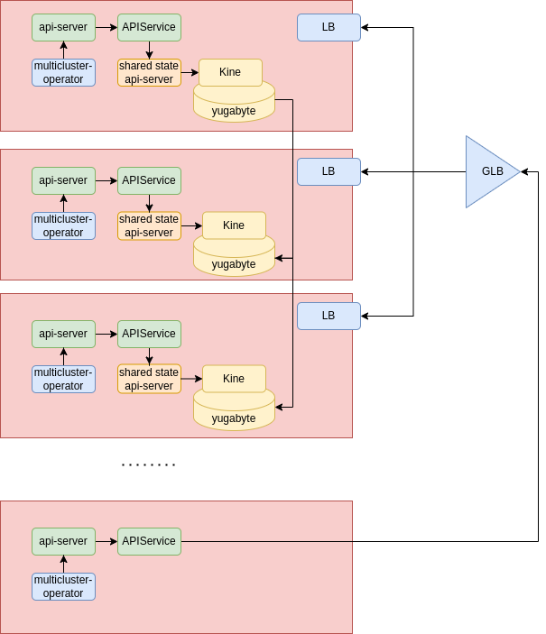

# Why Helium

Helium is an approach to creating a distributed control plane with the intent to make it easier to write multicluster operators.
What these operators will do is out of scope, so we think this solution is general enough to support any multicluster use case.

## traditional approach to multi-cluster

Typically, multicluster solutions look like this:

In this image we can see a hub cluster and several managed clusters.
The hub cluster control plane is used to drive the hub cluster, but also storage for multicluster shared state.
The managed clusters have special operators (multicluster operators in the picture) that have to watch both the local control plane and the hub control plane for the shared state.

This architecture has the following issues:

1. the hub cluster is a single point of failure.
2. the multicluster operators are hard to write as kubebuilder and other frameworks for developing operators are not designed for watching multiple control planes.
3. This architecture is not very scalable beyond a few hundred clusters.

## distributed control plane

To solve for the single point of failure issue, we can refactor the previous architecture to look like this:

In here we created a distributed control plane across three clusters, ideally in different failure domains.
The distributed control plane is also externally accessible from other clusters via local load balancers and a global load balancer.
This shared state control plane will store the shared state that every cluster needs to observe and manipulate.

One possible objection to this refactoring is that etcd does not lends itself to stretching across multiple  failure domain (presumably with large latency between them). This is general not true etcd can work with any latency as long as carefully tuned. Of course, the higher the latency teh less responsive the etcd cluster is. Low responsiveness is a problem for kubernetes especially when trying to meet the standard stress tests, which require high-level of churn for a few key resources such as namespaces, pods, services. Arguably the shared state, which is there to support multicluster use cases, does not carry those resources and certainly it does not require high level of churning.

This architecture still has the following issue:

1. The multicluster operators are hard to write as kubebuilder and other frameworks for developing operators are not design for watching multiple control planes
2. This architecture is not very scalable beyond a few hundred clusters. Scalability probably got even worse than before as with this refactoring as etcd is now less performant due to higher latency.
3. the `shared state api-server` should behave like an standard kube api-server but devoid of any innate kubernetes behavior. Currently I was not able to find a product/project to meet this requirement.

## api-service

To make it simple to write multicluster operators we can aggregate local state and shared state with the [ApiService](https://kubernetes.io/docs/tasks/extend-kubernetes/configure-aggregation-layer/) feature:

With this approach, multicluster operators need to connect to a single control plane and can distinguish between local and shared state by api domain.
This solves most of the problems with writing multicluster operators. Although some minor concern remains for when one needs to do a distributed leader election.

This architecture still has the following issues:

1. this architecture is not very scalable beyond a few hundred clusters.
2. the `shared state api-server` should behave like an standard kube api-server but devoid of any innate kubernetes behavior. Currently I was not able to find a product/project to meet this requirement.

## Kine and yugabyte

To make the system virtually indefinitely scalable we need change the storage. We need to introduce a storage product with partitions such that the system can scale horizontally.
We can use [Yugabyte](https://www.yugabyte.com/) for this (although there are other options). We will need an etcd shim to make the share state api server work with [yugabute](https://www.yugabyte.com/). For that we can use [Kine](https://github.com/k3s-io/kine).

The architecture now looks like this:

This architecture still has the following issues:

1. the `shared state api-server` should behave like an standard kube api-server but devoid of any innate kubernetes behavior. Currently I was not able to find a product/project to meet this requirement.

While designing for the share state api-server, the following requirements should be kept in mind:

1. it should be a standard kubernetes api-server, devoid of all the kubernetes innate behaviors. [KCP](https://www.kcp.io/) is a project with similar objective but does not really fit this requirement.
2. a multicluster leader election way should be defined.
3. an approach to dynamically add API (i.e. CRD) should be defined.